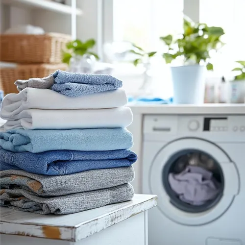

# Laundry Services Website

A clean, modern, and fully responsive single-page website for a professional laundry service business.

## ✨ Features

- **Fully Responsive Design** – Looks great on desktop, tablet, and mobile devices
- **Modern Navbar** with logo, navigation links, and clean layout
- **Eye-catching Hero Section** with compelling headline and call-to-action
- **Professional Color Scheme** (Dark navbar + clean light hero)
- **Mobile-First** approach with smooth breakpoints
- **Fast loading** and optimized CSS using modern techniques (`clamp()`, flexbox, grid)

## 📱 Responsive Behavior

- **Desktop**: Two-column hero layout with side-by-side content
- **Tablet**: Adjusted spacing and font sizes
- **Mobile**: Hero stacks vertically, navbar becomes centered and stacked

## 🛠 Tech Stack

- **HTML5**
- **CSS3** (Custom Responsive Stylesheet)
- No external frameworks (lightweight & fast)

## 📁 Project Structure
/
├── index.html
├── style.css
└── images/
├── logo.webp
└── image.webp

## 🎨 Sections Included

### 1. Navbar
- Logo on the left
- Navigation menu (Home, Services, AboutUs, ContactUs)
- Fully responsive

### 2. Hero Section
- Powerful headline: *"Revitalize your clothes with Expert Laundry Services"*
- Descriptive subtext
- Services list:
  - Wash & Fold
  - Premium Dry Cleaning
  - Express Ironing
- Prominent "Book a Service today!" CTA button
- Professional hero image on the right

## 🚀 How to Run

1. Download or clone the project
2. Make sure the folder structure is correct:
   - `images/logo.webp`
   - `images/image.webp`
3. Open `index.html` in your browser

**No build tools or server required** — just open the HTML file.

## 🎯 Customization

### Changing Colors:
- Navbar background: `.navbar`
- Brand color: `.L1`
- Button colors: `.cta-button`

### Updating Content:
- Edit text in `index.html`
- Replace images in the `images/` folder
- Modify styles in `style.css`

## 📄 License

This project is open for personal and commercial use.

---

**Would you like me to also include:**
- A "Screenshots" section with placeholders?
- Installation instructions for GitHub?
- SEO meta tags recommendations?
- Future features roadmap?

Just say the word and I’ll update it! 

You can copy the content above and save it as `README.md` in your project root.
## 🎨 Sections Included

### 1. Navbar
- Logo on the left
- Navigation menu (Home, Services, AboutUs, ContactUs)
- Fully responsive

### 2. Hero Section
- Powerful headline: *"Revitalize your clothes with Expert Laundry Services"*
- Descriptive subtext
- Services list:
  - Wash & Fold
  - Premium Dry Cleaning
  - Express Ironing
- Prominent "Book a Service today!" CTA button
- Professional hero image on the right

## 🚀 How to Run

1. Download or clone the project
2. Make sure the folder structure is correct:
   - `images/logo.webp`
   - `images/image.webp`
3. Open `index.html` in your browser

**No build tools or server required** — just open the HTML file.

## 🎯 Customization

### Changing Colors:
- Navbar background: `.navbar`
- Brand color: `.L1`
- Button colors: `.cta-button`

### Updating Content:
- Edit text in `index.html`
- Replace images in the `images/` folder
- Modify styles in `style.css`

## 📄 License

This project is open for personal and commercial use.

---
